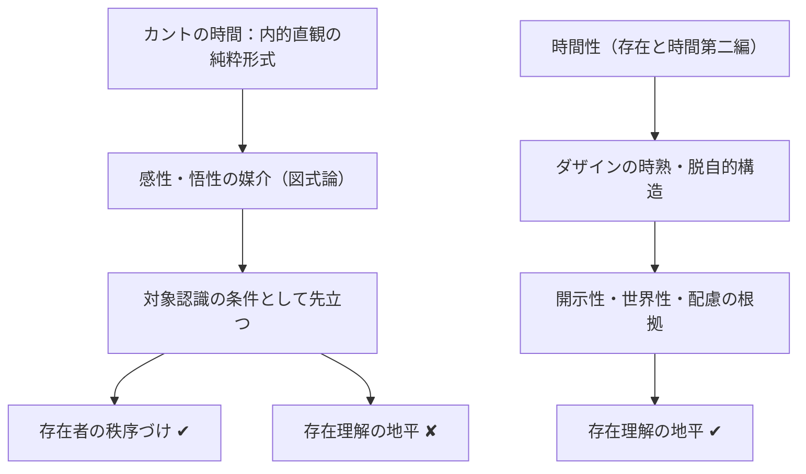

## カント章の小結：時間性の問題が存在論に届かなかった理由

*内的完結稿 — 第二部 時間性の問題に即した存在論の歴史の現象学的解体 / 第1章 カントにおける時間 / 節 id: P2-01-04*

---

### 本章の問いを振り返る

本章が追ってきた問いは、一見単純に見える。カントは時間を哲学の核心に置いた最初の近代思想家の一人であり、彼の批判哲学において時間は経験成立の不可欠な条件として認定される。それならば、カントこそが存在論と時間性の連関を開示した先駆者となるはずではないか。本章はこの期待に応えつつも、同時にその期待が裏切られる地点を精確に示すことを課題としてきた。

カントにとって時間は、外的直観の形式である空間と対をなす内的直観の純粋形式である。時間はアプリオリ（経験に先立って）に与えられており、感性的直観に現れるすべての現象はこの時間という形式の内に秩序づけられる。さらに純粋悟性概念の図式論においては、時間こそが悟性の概念と感性の直観とを媒介する役割を担い、因果性・実体性・相互制限といったカテゴリーが現象に適用されうるのも、時間的図式を通じてこそである。この意味でカントは時間をあらゆる対象認識の条件として「先立たせた」と言える。

---

### 対象化の条件としての時間——限界の所在

しかし、まさにここに問題の核心がある。カントが時間を先立たせるとき、それは**ダザイン（そこに在ること、現存在）の存在理解の地平**としてではなく、あくまで**対象化の条件**としてである。

存在理解の地平としての時間性とは何か。『存在と時間』第一部第二編が示したように、ダザインは死へ向かう存在として己の有限性を引き受け、そこから既在性（過去性）・現在・将来という三様の時間的脱自（エクスターゼ）において自己を開示する。この時間性は対象を秩序づける形式ではなく、ダザインがそもそも「存在する」こと、すなわち存在を理解しつつ存在するという出来事そのものの構造である。時間性はダザインの存在論的な開示性（世界が意味を持って現れてくること）を下支えしており、配慮や世界性といった現存在分析の成果がすべてここへ収斂してくる。

カントはこの次元に届かない。彼が問うのはつねに「現象がいかにして認識主観に対して成立するか」であり、問いの射程は認識論的な条件論の内に留まる。時間は確かに主観の側に見出されるが、それは感性的直観の制約として機能する時間であって、ダザインが己の存在可能性へ向けて時熟（Zeit igen）することではない。別言すれば、カントの時間は**存在者の秩序づけを可能にする形式**であり、**存在理解そのものが成立する地平**ではない。

この図が示すように、両者はいずれも時間を「先に」位置づける点では似ているが、その「先」が何に対して先なのかが根本的に異なる。カントでは認識論的対象に対して先であり、本章の分析では存在論的存在理解に対して先である。

---

### 存在論的差異への不感性

この限界はさらに深く診断できる。カントの枠組みには**存在論的差異**——存在者と存在そのものとの区別——への感受性が十分に働いていない。カントが批判哲学において問うのは、存在者が経験のうちにいかに現れるかという問いである。「物それ自体」という概念がこの批判の限界を示すとしても、それは存在の問いとして定式化されるのではなく、認識不可能な境界として措かれるにすぎない。存在の問いがダザインの存在理解という土台から問われるかぎり、その問いはカントの問い設定の外側に発している。

カントにおいて流俗時間（日常的に「時計で計れる」と了解されているような均質な今の連続）と時間性の根底的な差異は主題化されない。彼の時間論は、流俗時間の構造を精緻に分析・正当化したと言えるが、その流俗時間がダザインの本来的時間性から派生するという構造的連関は、問いの内に入ってこない。

---

### デカルト章へ——より原初的な平坦化へ

カント章が示したのは、時間を先立たせながらもその時間を存在理解の地平として捉えそこなった一つの典型的な様態である。しかしこの問題設定を歴史的にさらに掘り下げるならば、われわれはより原初的な地層へと降りていかなければならない。

カントが前提しているのは、認識する主観と認識される客観という分割——すなわち主客の図式——である。この図式はカントによって批判的に吟味されるとはいえ、問いの出発点としては温存されている。ところが、ダザインの現象学的分析が示したように、ダザインはまず配慮的に世界の内に住まっており、道具的に「手元にある」ものに関与しながら存在している。主観対客観という対立は、この根源的な世界内存在の構造から後続的に析出される二次的な図式にすぎない。

デカルト章が問うのは、この主客の図式がいかにして哲学的思惟の自明な出発点として定着したか、換言すれば、世界内存在の根源的な開示構造がいかにして**平坦化**され、延長する物体の集積として世界が捉えられるに至ったか、である。カント章の分析は存在理解の地平としての時間性を問題にするうえでの近代的限界を示した。デカルト章はその限界が立つ地盤そのもの——主客の図式という土台——をより原初的に問い直す試みとなる。解体（Destruktion）の歩みは、時代を遡るほど根底的な層へと届く。
