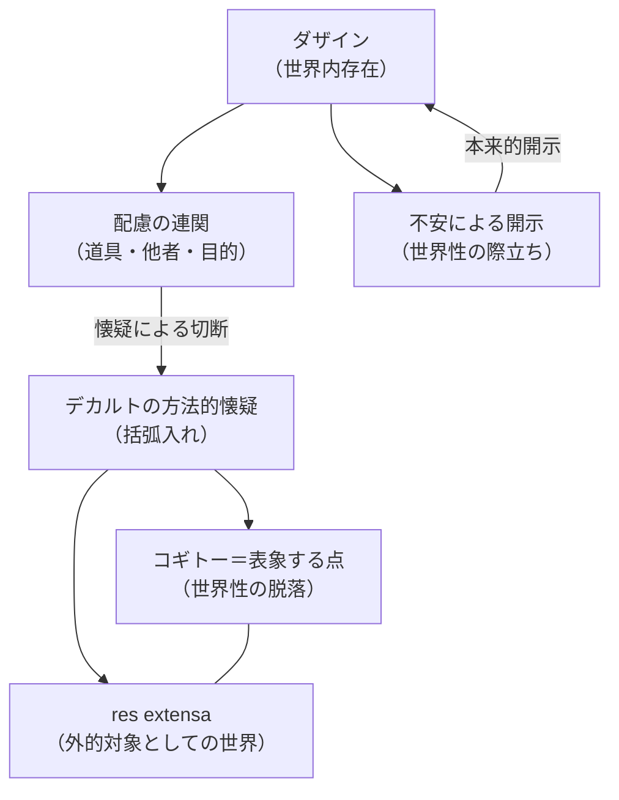

## 「コギトー」と世界内存在の切断

*内的完結稿 — 第二部 時間性の問題に即した存在論の歴史の現象学的解体 / 第2章 デカルトにおける「我思う」存在者と時間 / 節 id: P2-02-01*

---

### 主客図式の存在論的前提

「我思う、ゆえに我あり（*cogito, ergo sum*）」という定式は、哲学史上しばしば疑いえない出発点として称揚されてきた。しかしここで問われなければならないのは、この「我思う」という言明が、いかなる存在論的前提のもとで成り立っているか、という問いである。

存在論的前提とは、ある存在者を理解する際に、その存在者の存在様式についてあらかじめどのような了解が働いているかを指す。デカルトの定式においては、「思う」主体としての我（*res cogitans*、思惟する物）と、思惟される対象としての世界（*res extensa*、延長する物）とが、截然と対置される。この分割こそが、いわゆる主客図式と呼ばれる構造である。

だが、ここで問い返すべきことがある。主客図式は、思惟する主体が最初から世界と無関係に孤立して存在し、その後に外的対象へと「関わりに出てゆく」という了解を前提としている。このとき世界は、主体に対して外側から立ちはだかる対象の総体として捉えられる。『存在と時間』においてすでに析出されたダザイン（*Dasein*、人間の存在様式を指す術語、字義的には「そこに在ること」）の根本構造は、まさにこの前提に異議を申し立てるものであった。ダザインとはそもそも「世界の内に在る」存在者であり、世界はダザインに後から付加される外的対象ではなく、ダザインの存在の根本的な規定に属する。世界性（*Weltlichkeit*）とは、ダザインが世界のなかに没入し、すでに道具や他者とのかかわりのうちに開かれているという、その存在様式の特性にほかならない。デカルトはこの世界性を、問うことなしに脱落させてしまう。

### 「疑う」という様態と世界性の脱落

デカルトが方法的懐疑において採用した手続きを、『存在と時間』の概念装置から改めて照らし出してみよう。「疑う」という行為は、たんなる認識論的操作ではない。現象学的に見るならば、疑うこととは、ダザインが日常的な配慮（*Besorgen*）の連関——手もとにある道具を用い、他者と共に或る目的へ向けてかかわる、あの実践的なたずさわり——から引き剥がされる様態として捉えることができる。

ここで不安（*Angst*）という気分との交差に注目せよ。不安は、ダザインが常人（*das Man*）の中に安住することができなくなる気分であり、そこにおいてダザインは、世界内存在そのものへと鋭く照らし出される。不安は世界から切り離すのではなく、むしろ世界内存在の開示（*Erschlossenheit*）——ダザインが自己と世界の双方を同時に「明け開いて」いるあり方——を、その根底から暴露するのである。不安においてこそ、世界性は最も先鋭に「無気味（*unheimlich*）」なものとして、すなわちもはや安らぎの「家（*Heim*）」ではないものとして、際立つ。

デカルトの「疑う」はしかし、この不安の契機を踏みとどまることなしに通過してしまう。疑いは世界内存在の開示を手がかりとするのではなく、それを括弧に入れ、ついには「延長する物としての世界」という存在論的に貧しい残滓のみを後に残す。こうして「疑う我」は、配慮の連関を失い、道具も他者も剥ぎ取られた「表象する点」へと収縮される。世界性が脱落したその場所に立てられるのが、コギトーの「我」である。

### 解体の測度――世界内存在の特権の喪失

以上の分析から、デカルトの存在論が歴史的解体（*Destruktion*、受け継がれた概念を批判的に掘り崩し、その隠れた根拠を露わにする手続き）の対象となる理由が明確になる。解体が問うのは、ある思想が「誤っているかどうか」ではなく、それが存在論的にいかなる層を隠蔽しているか、である。

デカルトのコギトーが隠蔽するのは、ダザインの存在論的特権、すなわち世界内存在という根本構造である。ダザインは良心（*Gewissen*）の呼び声を聞き、死（*Tod*）へ先駆することで、自己の固有な存在可能性へと決断性（*Entschlossenheit*）において立ち戻る。こうした存在様式の豊かな起伏はすべて、ダザインがすでに世界のうちに投げ込まれ、世界とともにあるという事実に根ざしている。コギトーはこの根を断ち切ることで、時間性（*Zeitlichkeit*）——ダザインの存在の意味を構成する、到来・既在・現在の統一的な運動——とも切り離された、非時間的な点状の主体を創出する。

このことが示すのは、コギトーが「存在論的に無害な出発点」ではなく、ダザインの存在構造を根本的に誤読した出発点であるということだ。「我思う」は、すでに世界に関わっているダザインを、表象の点へ縮約する。この縮約の暴力こそ、続く節が解明すべき問題の核心を構成している。
