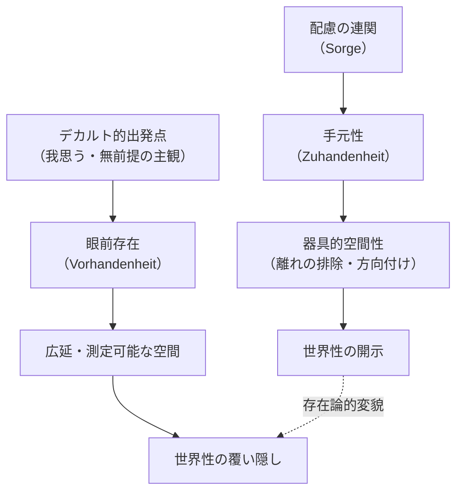

## 広延物としての「世界」と手元性の覆い隠し

*内的完結稿 — 第二部 / 第2章 / 節 id: P2-02-02*

---

### 一　デカルト的自然概念と存在論的自然概念のすれ違い

デカルトは「世界」を問うとき、その問いをただちに自然物の本質規定へと転換する。自然物の本質とは何か。それは広延（res extensa）、すなわち三次元的空間における占有である。この規定によれば、世界に属するものとは、高さ・幅・奥行きによって測定可能なものの総体にほかならない。世界はかくして「広延物の集積」として理解される。

しかしここで問わなければならないのは、この規定がいかなる存在論的地盤の上に成立しているか、ということである。『存在と時間』が解明したところによれば、ダザイン（現存在、すなわち存在を問いとして引き受けるこの私たち自身の存在）は、最初から「世界のうちにある」という構造のもとで存在している。この「世界のうちにあること」は、ダザインが主観として外部の客観に向かい合うという図式に先立っており、そうした図式を可能にする基礎的な開示（存在者がそもそも「ある」として現れること）の場そのものを意味する。デカルトが「世界」と名指すものは、この開示の場を括弧に入れた後に残る抽象的な残滓にすぎない。換言すれば、デカルト的自然概念は、世界性（世界が世界として開かれている構造）を消去することによってはじめて成立する。二つの自然概念のすれ違いはここに根を持つ。一方は開示の構造に問いを向け、他方は開示そのものを問わずして「すでに開かれているものの内容」のみを記述する。

### 二　器具分析・空間性分析と広延の存在論の対照

『存在と時間』の器具（道具、Zeug）分析は、日常的なダザインが存在者に出会う際の第一次的な様態が「手元性（Zuhandenheit）」であることを示した。手元性とは、存在者が配慮（Sorge）の連関のなかで「使われつつある」「差し向けられている」という存在様式である。망치（槌）は叩くために手に取られ、釘は打ち込むために差し向けられ、建材は住まいのために用意される。こうした指示連関の全体がそのつど開かれており、ダザインはこの開示の網の目のなかで何かに「携わっている」。

この器具的連関における空間性は、測定可能な距離・角度としての空間ではない。槌が「近い」とはそれが「手もとにある」「すぐ使える」ということであり、これは客観的な尺度ではなく、配慮に根ざした「離れ（Entfernung）の排除」と「方向付け（Ausrichtung）」によって構成される。ダザインの空間性は、三次元座標のなかに点として位置づけられることではなく、有意義性（何かが何かのためにある、という連関）に潜在している。

これに対してデカルトの広延は、まさにこうした配慮的連関を削ぎ落とすことで得られる。広延において「近さ」は絶対的な測定値に変換され、「方向」は座標軸上の方位に還元される。存在者は手元にあるものとしてではなく、前方に立てられた（vorgestellt）対象として、すなわち「眼前存在（Vorhandenheit）」として捉えられる。この転換は些細な認識論的選択ではなく、存在論的な変貌である。器具分析が明かした開示の構造——何かがダザインのために、配慮のなかで現れてくるという構造——がそっくり隠蔽される。

### 三　「運動の数」としての時間と時間性としての配慮の隔たり

デカルト的存在論において時間はどのように位置づけられるか。広延が空間の記述原理であるとすれば、時間は運動の継続を測る尺度として機能する。この着想はアリストテレスの「時間とは運動の数である」という規定を継承しており、時間を「今の系列」「瞬間の連続的配列」として捉える。時間はかくして、空間と並列する均質な秩序の次元として、外部から観測可能な出来事の経過を計量する枠組みになる。

しかし『存在と時間』が解明した時間性（Zeitlichkeit）は、こうした流俗時間（日常的・通俗的な時間理解）とは根本的に異なる。時間性はダザインの存在様式そのものの構造であり、「既在性（すでにそうであったこと）・現在化（そのつどここで関わること）・到来（向かい来るもの、とりわけ死へ向かう先駆け）」という三つの脱自的契機の統一として把握される。配慮という存在様式は、この時間性の統一的な脱自において初めて可能になる。道具を手に取り、仕事に携わり、完成へ向かうという一連の動きは、到来・既在性・現在化が一体となって開示されるなかで成立している。

これに対してデカルトが語る時間は、こうした開示の構造をいっさい問うことなく、「今」から「今」へ推移する均質な系列として想定される。流俗時間がいかにして成立するかといえば、それは時間性という根源的な構造が「平均化」「均一化」されることによって生じる。内時間性（Innerzeitigkeit）、すなわちダザインが世界のうちで配慮しながら時を数えることが、根源的な時間性から派生して生まれる。デカルトの時間論はこの派生的水準のみを扱い、そこへ至る経緯を問わない。

こうしてデカルトにおいては、世界が広延物の総体として記述され、空間が配慮から切り離され、時間が運動の均質な数として解釈されることで、手元性という存在様式が三重に覆い隠される。手元性の時間的開示——道具が「今まさに使われ」「かつて用意され」「次の仕事へ向けて差し向けられている」という時間的連関のなかで現れること——は、空間的広がりの表象へと還元され、その痕跡すら残さない。

### 四　解体の必然としての問い

以上の対照が示すのは、デカルト存在論が誤謬であるという単純な批判ではない。眼前存在の存在論、広延の存在論、流俗時間の存在論は、それ自体として一定の整合性を持ち、近代的自然科学の基礎を提供することができた。問題は、この存在論が「唯一可能な存在論」として自明視されるとき、手元性の開示に潜む時間性の問いが封じられることにある。存在論的差異（存在と存在者の差異）を問い返す視線が失われ、存在者の記述が存在の解明に置き換えられてしまう。

第二部が遂行する現象学的解体は、デカルトの体系を破壊することではなく、その体系が由来する開示の層を掘り当てることである。広延物の総体として記述された「世界」の下に、配慮の時間性が開く「世界のうちにあること」を取り戻すこと——それがこの節の問いを次章へと引き渡す論理的必然である。
