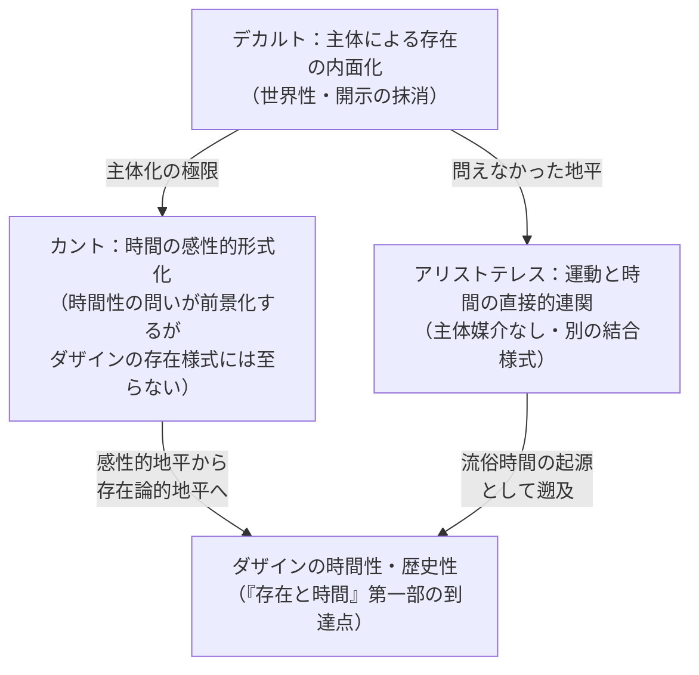

## デカルト章の小結：主体の誕生とダザインの抹消

*内的完結稿 — 第二部 / 第2章 / 節 id: P2-02-04*

---

### 問いの圧縮点として

本章を通じて照らし出してきた事態を、ここで一つの命題へと圧縮しなければならない。デカルト的立場は、存在者を存在者として見出すことの存在論的条件を、主体の内面へ吸い込む。これが本章の帰結である。この命題が意味するのは、単に「デカルトは間違っていた」という批判的評価ではない。問題はより根底的である。デカルトにおける「我思う、ゆえに我あり」は、確実性を基礎づける手続きとして提示されたが、その操作において何かが静かに消去された。消去されたのは、ダザイン（現に「そこ」に在ること、すなわち世界内に投げられ配慮的に関わりながら存在する人間の存在様式）が世界へと開示されていること、その「開示」の構造そのものである。

存在論的差異とは、存在者と存在（存在者がそもそも「ある」ということの意味）を区別する視点のことを指す。デカルトの操作は、この差異を思惟する主体の内的確実性へと還元することで、存在の問いをいわば「主体」という一点に溶かし込んでしまう。世界性——ダザインが道具や他者や環境と切り離せない仕方で織り合わされている構造——は、懐疑によって括弧に入れられ、最終的には延長する実体（res extensa）と思惟する実体（res cogitans）という二元的図式の中に再配置される。そのとき「世界」はすでに内側から再構成された観念の秩序へと変質しており、ダザインが本来もつ世界内存在としての根本構造は姿を消している。

### カント章との差異——一つの確認

続く第3章が扱うカントの問題設定との差異を、ここで一行だけ確認しておくことは、論述の流れを整えるために有益である。カントにおいては、時間は内的感性の形式として直観の地平を構成するものとして析出される。それゆえカントの問いは、「主体が時間をいかに所持するか」という方向へ傾く。デカルトにおいては、そもそも時間そのものが存在論的問題として前景化されることなく、持続（duratio）として神の恒常的創造に依拠する様式でのみ語られる。言い換えれば、デカルトでは時間性の問いが実質上眠ったままであるのに対し、カントでは時間が明示的に問われる地平へと出てくる。しかしカントもまた、時間性をダザインの存在様式そのものとして——歴史性や決断性の根底として——把握するには至らない。その限りで両者は、異なる仕方で同じ一つの問い、すなわち存在と時間の連関を十全に展開できないでいる。

### 常人性と主体——もう一つの回路

デカルト的主体の誕生は、別の側面からも問われなければならない。『存在と時間』第一部が析出した「常人（ダス・マン）」の構造——誰でもあり誰でもない、没個性的な公共性の中にダザインが埋没する様式——は、デカルト的主体概念とどのような関係にあるか。常人の存在様式において、ダザインは自己の固有な死へ向かう存在であることを覆い隠し、非本来的な平均的日常性のうちに頽落する。デカルトの「我」は、この頽落の運動を哲学的反省のレベルで反復している、と言うことができる。なぜなら、確実性の探求として提示されるデカルトの懐疑は、ダザインが配慮としての存在様式において本来すでに世界に開示されているという事実を、主体の自己確証という操作によって遮蔽するからである。良心の呼び声が常人のざわめきを切り裂いてダザインの本来性へと呼び戻すように、存在論的分析論は「我」の確実性の背後にある開示の構造を呼び戻そうとする。

### アリストテレスへ——結合様式の別の層

本章の小結はしかし、批判的終着点ではなく、次の問いへの架け橋である。デカルトが問えなかった時間と存在の連関は、より古い層においてはいかなる様式で問われていたか。第3章以降が向かうアリストテレスの時間論においては、時間は「以前」と「以後」に即して数えられる運動の数として規定される。この規定は、ダザインの時間性から派生した「流俗時間」——日常的な「いつ」「どのくらい」という時間理解——の前身として位置づけられる。しかし重要なのは、アリストテレスにおいてはまだ、時間と存在が同一の問いの磁場の中で、デカルト的な主体内面化とは異なる結合様式を保持していることである。自然学的な運動と時間の連関、「今（ニュン）」の連続としての時間把握は、存在論的差異を十全に展開してはいないものの、「主体」という媒介なしに存在と時間を直接問おうとする身振りをなお保っている。

デカルト章の作業が示したのは、一つの誕生と一つの抹消が同時に起きるという逆説的事態である。主体が誕生するまさにその地点で、ダザインが——世界の内で死へと向かいながら良心に呼ばれ決断性へと促される、あの固有な存在者が——存在論的視野から姿を消す。これを確認することが、解体の作業における一つの必然的な立ち止まりを構成する。次の問いへの歩みは、この立ち止まりを踏み台としてのみ可能になる。
