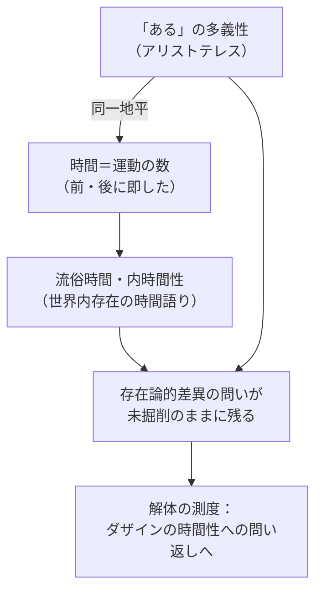

## 存在理解の語法と時間論の近接

*内的完結稿 — 第二部 / 第3章 / 節 id: P2-03-01*

---

### 「ある」の多義性と時間規定の同一地平

哲学の仕事は、ひとたびある問いを開いたならば、その問いが届いていなかった地層まで掘り下げることにある。存在の意味への問いを中心に据えた既刊の探究が示したのは、ダザイン（*Dasein*）――「そこに在る」という仕方でみずからの存在を問題にしている存在者、すなわち人間的現存在――の存在の分析なしには、存在一般の意味は原理的に解明できないという事態であった。いまここに開かれる第二部の仕事は、この洞察を歴史の方向へ向け直すことにある。その出発点としてアリストテレスを選ぶのは恣意ではない。「ある（*einai*）」という語の多義性を体系的に摘出し、かつ時間を自然のなかに定位した探究が古代においてもっとも鮮明に刻まれているのが、まさにこの思索者の著作群に他ならないからである。

アリストテレスは「ある」を多義的に語る。実体として、偶有性として、可能態として、現実態として、また真偽という様相において。こうした「ある」の語法の多様性は、存在がひとつの均質な面に広がるのではなく、それぞれ異なる連関において現れることを見て取った誠実さの記録である。同時にアリストテレスは時間を「運動の数であって、前と後とにしたがって数えられたもの」として定義する。注目すべきは、この二つの探究が同一の問いの地平に属しているという事態である。「ある」の語法が存在者のあり方の多様な現れを辿ろうとするものであるとすれば、時間の定義は存在者の変化を測定する視点から存在の時間的側面を捉えようとするものである。両者は互いに無関係な問いではなく、存在者がいかに「ある」かを問うという共通の地面に根をもっている。この近接そのものは、古代の思索が存在と時間の問いを引き寄せて考えていたことの証左であり、それ自体として豊かさと評価されるべき事態を含んでいる。

---

### 近接の豊かさと存在論的差異の鈍化

しかしながら、近接が同時に一種の鈍化を招くという逆説を看過することはできない。「ある」の多義性とは存在の豊かさへの感受性の表れであるが、その多義性がそのまま「存在者のあり方の多様な種類」として列挙されるかぎりにおいては、存在そのものと存在者との根本的な差異――存在論的差異と呼ばれるべき裂け目――は、問い立てられぬままに残る。存在者が「ある」という事態、すなわち存在者の存在は、存在者そのものとは異なる地平に属するという洞察は、多義性の目録によっては自動的に準備されない。

同じことが時間論についても言える。アリストテレスの時間定義は、運動する自然存在者の変化を前と後という系列において数える「現前する今（ニュン）」を基点にしている。この定義においては、時間は変化する存在者の運動を測定する枠組みとして現れる。既刊の分析が「流俗時間」あるいは「内時間性」として取り上げた概念の連関、すなわちダザインが世界内での配慮的関わりのなかで「今ここに……がある」「今に……する」「今に……した」と時間を語る仕方は、まさにこうしたアリストテレス的な時間理解の地続きにある。流俗時間は偽りの時間なのではない。それはダザインの時間性がみずからを世界内存在として開示するときに必然的に世界のなかへ落ち込んでいく相であり、だからこそ哲学史の大半がこの相の内部にとどまることになった。

近接の豊かさと差異の鈍化は、したがって同一の事態の二つの顔である。

---

### 解体の測度――自然存在者の文脈の効力と限界

現象学的解体（*Destruktion*）とは、哲学の伝統が地層のように積み重ねてきた概念を破壊し無に帰することではない。それは積み重なった地層を掘り起こし、それぞれの概念がもともとどのような問いの応答として形成されたかを取り出す作業である。アリストテレスの時間論を解体の対象とするとき、問われるべきは、「自然存在者の変化の文脈で語られる時間」という枠組みがいかなる範囲において有効であり、いかなる点において限界をもつかという測度である。

その効力は明確である。アリストテレスの分析は、時間が「今」の連続として現れ、かつその「今」が常に過去の今・現在の今・未来の今という構造を含んでいることを鮮明に取り出した。これは現象への実直な接近であり、日常的なダザインが時間を語るときの仕方をそのまま概念化したものとして、世界内存在の構造の一端を示している。

しかし限界もまた明確である。時間が自然存在者の運動の尺度として定義されるとき、時間はダザインの存在の根本構造としての時間性から切り離される。時間性とは、既刊の第二編が明らかにしたように、ダザインが死へと向かう存在として、良心の呼び声を聞き、決断性において本来的な実存へと開示される際に、その存在全体の意味として露わになる構造である。将来・既在性・現在が脱自的に統一された時間性は、今の連続によって測定される時間とは次元を異にする。アリストテレスの時間論は、時間性がみずからを世界へと落ち込ませ平均化された姿を分析しているのであって、時間性そのものの問いへは届いていない。

ここにアリストテレスの功績と限界の双方を引き受ける解体の任務が定位される。古代において存在の語法と時間の規定が同一の地平で探究されたことは、問いの豊かな前史である。しかしその近接は、ダザインの存在論的特権――すなわちダザインのみが存在の意味を問いうる存在者であり、その問いの可能性の根拠が時間性そのものにあるという洞察――を掘り当てるまでには至らなかった。この「いまだ掘られていない」という事態を正確に測定することが、第二部の仕事の出発点であり、同時にそれは第一部の分析が歴史へと折り返す必然の地点でもある。
