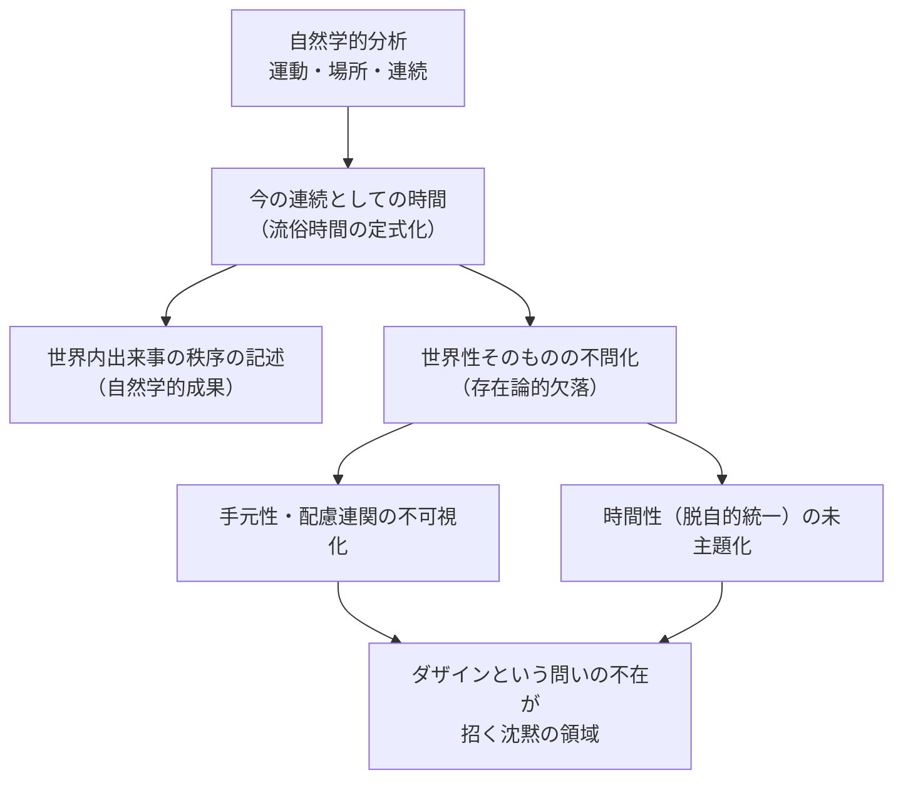

## 自然学としての時間と世界内存在の未分離

*内的完結稿 — 第二部 時間性の問題に即した存在論の歴史の現象学的解体 / 第3章 アリストテレスにおける時間と存在 / 節 id: P2-03-02*

---

### 運動・場所・連続という三つの軸

アリストテレスが時間を問うとき、その問いはつねに「運動（kinēsis）」の分析を経由する。運動とは或るものが或る状態から別の状態へ変化することであり、その変化は「場所（topos）」における位置の推移として最も原型的に現れる。さらに、この推移が断絶なく連なるという「連続（to syneches）」の性格が、時間に「流れ」という様相を与える。この三つの軸——運動・場所・連続——は互いを支え合いながら、自然学的時間論の骨格を形成している。

ここで注意すべきは、これらの概念が世界内に差し出された「事物」の振る舞いを記述するものとして構成されている点である。運動するのは石であり、星であり、水である。場所とはそれらが占める空間的位置であり、連続とはその推移が数として数えられうることを意味する。かくして時間は「運動の数、前と後の側面に従って」と定式化されるに至る。この定式において、時間は世界内の出来事が秩序だった継起をなすという事実の記述として完結している。

### 手元性・環世界との非還元的対照

しかしながら、『存在と時間』の既刊部分が明示した「世界性（Weltlichkeit）」の分析から振り返るとき、アリストテレスの定式には看過できない非対称性が浮かび上がる。世界性とは、事物が孤立した「眼前的存在者（Vorhandenes）」として並置されている場ではなく、ダザインの配慮（Sorge）の連関によってはじめて開示される「有意義性の全体」である。道具が「手元的（zuhanden）」に現れるのは、それが連関の中で何かのためにあるという仕方で了解されているからであり、この了解の地平こそが環世界（Umwelt）を構成する。

アリストテレスの運動論は、この手元性・環世界の次元を原理的に括弧に入れたところで成立している。石の落下を記述するとき、そこに「石が何かのためにある」という配慮の連関は主題として問われない。場所はユークリッド的な幾何学的位置に近似し、連続は純粋な数的継起として扱われる。これは誤謬ではなく、自然学という問い方が正当に採用した「眼前的存在者」への還元である。しかしまさにその正当性ゆえに、世界性そのものが問われることなく沈黙させられる。運動・場所・連続の分析は、世界内の出来事の秩序を見事に捉えながら、その秩序がなぜそのように「世界内に」現れるのかという問いには沈黙したままである。換言すれば、流俗時間（vulgäre Zeit）の構造を精緻化しながら、その流俗時間がより根源的な時間性（Zeitlichkeit）から派生してくる道筋を問わない。

### ダザインという問いの不在——利点と欠落の両面

このような問いの不在は、二重の意味をもつ。

第一に、利点として、アリストテレスの自然学的時間論はダザインという問いを介在させないがゆえに、世界内の出来事の秩序を普遍的・反復可能な記述として定式化することに成功している。「今（nyn）」が「前」と「後」の間に挟まれるという構造は、特定のダザインの実存様態に依存しない普遍的連関として提示される。この定式化はその後の自然科学的時間概念の基盤となり、時計によって測定される「均質な時間」の原型を供給した。

第二に、存在論的欠落として、ダザインの問いが不在であることは、時間の根源的な開示の場——すなわちダザインが「世界内存在（In-der-Welt-sein）」として自らを開示する構造——が問われないことを意味する。『存在と時間』の既刊部分が示したように、時間性はダザインの存在の意味として、配慮の構造を統一的に可能にするものとして分析された。将来（Zukunft）・既在（Gewesenheit）・現在（Gegenwart）の脱自的統一としての時間性は、事物の連続的継起としての時間とは次元を異にする。アリストテレスの「今の連続」は、まさにこの時間性の「現在」の脱自的性格が均質化され、点状の「今」の系列として沈殿したものとして読みうる。しかし当のアリストテレスにとって、その沈殿の起源は問題にならなかった。

### 世界性の時間性という問われぬ問い

かくして本節の核心に到達する。時間は世界内の出来事の秩序として明らかになるが、世界性そのものの時間性は主題化されない。アリストテレスが捉えた時間は、ダザインの実存という地盤を経由せずに直接に事物の運動へと向かうことで、その精密さを獲得した。しかしその精密さの代償として、なぜ世界が「配慮の連関において有意義性として開示される」のかという問いは棚上げされ、世界性の時間性——世界が時間的に組織された開示の構造を持つという事実——は沈黙のうちに前提されたままとなる。

この沈黙こそが、解体（Destruktion）の課題を告げている。解体とは、アリストテレスを批判して廃棄することではない。むしろアリストテレスが正当に問い得た領域とその問い方の限界とを、存在論的差異（ontologische Differenz）の視点から透過的に照らし出すことである。事物の運動が時間の中にあるという命題は真である。しかしその真理は、ダザインが世界内存在として時間性のうちに開示されているという、より根源的な事態の上に浮いている。第二部の論述が「続書」として論理的必然をもつのは、まさにこの沈黙した地盤を掘り起こし、自然学的時間論がそこから派生してくる道筋を顕わにするためである。
