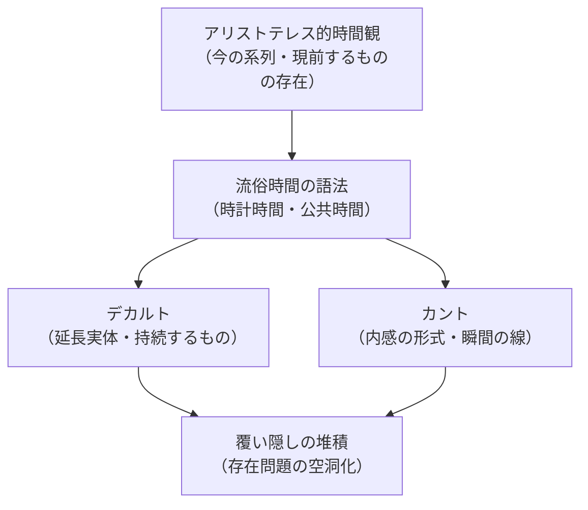

## 存在論の歴史の「起点」として

*内的完結稿 — 第二部 時間性の問題に即した存在論の歴史の現象学的解体 / 第3章 アリストテレスにおける時間と存在 / 節 id: P2-03-03*

---

### 「起点」を正しさの座から引き離す

存在論の歴史を遡行するとき、「もっとも古い」ということが「もっとも正しい」ことを意味しないのは自明に思われる。しかしそれ以上の注意が必要である。起点を「誤りの始まり」と捉えるのもまた一つの素朴さだ。問題はもっと根深い。起点としてのアリストテレスが重要なのは、彼の思索が「真理」を先取りしているからでも「誤謬」を播いたからでもなく、**後世のあらゆる覆い隠しが可能になるための地盤を最初に形成した**という、構造的な意味においてである。

ここで言う「覆い隠し」とは、ダザイン（現存在、すなわち問いを問うことができる存在者としての人間）が自己の存在様式を直接的に見通せなくなること、そして存在一般の問いが常人（ひとびと一般としての匿名的な公共性）の日常解釈に吸収されてしまうことを指す。解体（Destruktion）の課題は、こうした覆い隠しの堆積層を剥がすことである。アリストテレスの層は、その最下層に据えられる。最下層とは、それ自体が「正解の層」であるのではなく、**後続の覆い隠しがそこに積み重ねられた基岩**という意味である。基岩が露出すれば、地層全体の形成史が初めて読み解ける。

### デカルトとカントが引き継いだもの

近世哲学の二つの頂点、デカルトとカントが立つ地盤は、一見すると古代存在論とは切断されているように見える。しかし語法と時間観の水準で辿れば、連続が見えてくる。

デカルトが「延長するもの（res extensa）」と「思考するもの（res cogitans）」を区別し、世界を客観的に延長した物体の集合として規定するとき、そこには世界性（ダザインが道具や他者とともに存在する関係連関の全体）への問いが既に収縮している。世界はすでに「前に置かれた対象の総体」として先取りされ、配慮（日常的な気遣いのうちに道具的存在者と交わること）の構造は視野から外れる。この収縮の語法は、存在者を「持続する現前のもの」として問う存在様式に依存しており、その様式の輪郭はアリストテレス的な「今（ニュン）の系列としての時間」把握のうちにすでに描かれている。流俗時間（時計で測られ、今の連続として表象される通俗的な時間理解）がデカルト的な実体概念と内密に共鳴するのはこの理由による。

カントへ目を転じても事情は変わらない。カントが時間を「内感の形式」として析出し、直観の純粋形式と位置づけるとき、時間は依然として「現象が現れ出る場」として主観の側に繰り込まれる。これは鋭い転換であり、近代哲学の大きな成果である。だが時間が「諸瞬間の無限に続く線」として描写されるかぎり、その基礎には流俗時間の図式が生きている。内時間性（ダザインの気遣い構造が「時間を数える」ことを可能にする根源的な層）の水準から見れば、カントの時間論は時間性（ダザインの存在論的な根拠としての本来的な時間の三次元的統一）そのものには届かず、すでに平準化された時間像を精緻化するにとどまる。

### 解体の最下層として据えるということの意味

以上の連関は、アリストテレスを「諸悪の根源」として断罪することを意図しない。むしろ逆である。アリストテレスにおける時間と存在の連関は、その後に堆積する覆い隠しが分有する語法を最初に析出した試みとして、解体の作業が必ず到達しなければならない地点である。

存在論的差異（存在と存在者を混同せずに問い分ける態度）の視点から言えば、アリストテレスの層は、存在者の存在についての問いが最初の形を得た地平であると同時に、存在問題がまだ「存在者としての自然・運動・時間」へと即座に向けられていた地平でもある。解体は、この地平を暴露することで、デカルトやカントが何を受け取り、何を閉じたかを可視化する。そうして初めて、第一部・第二編で展開された時間性と歴史性の分析が、単に「ダザインの内側の記述」にとどまらず、**存在論の歴史全体に対する論理的必然を持つ問い**として機能することが明らかになる。

アリストテレス的層を最下層に据えることは、そこで立ち止まることではない。それはむしろ、地層の全貌が初めて測量可能になる基準点を打ち立てることである。そこから地表——すなわちわれわれ自身の問い——が、どれほどの厚みの覆い隠しの上に立っているかが、ようやく問いに付されうる。
