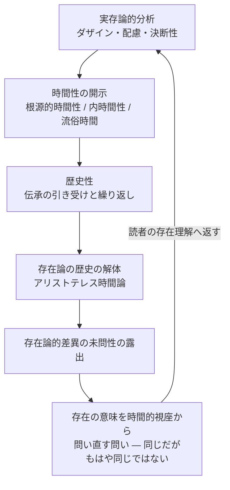

## 第二部総括：解体後に残る問い

*内的完結稿 — 第二部　時間性の問題に即した存在論の歴史の現象学的解体 / 第3章　アリストテレスにおける時間と存在 / 節 id: P2-03-04*

---

### 三つの運動の収束

『存在と時間』の既刊部分が描いた概念の運動は、大きく三つの層をなしている。第一に、ダザイン（現存在）の実存論的分析。第二に、その分析を支える根拠としての時間性の開示。第三に、時間性から歴史性へ、そして歴史性から伝承された存在論の批判的読解へという運動である。

第一の層においてダザインは、世界の内に投げ込まれ、配慮（ものごとへの実践的かかわり）として存在する存在者として記述された。配慮の統一的構造は、現実性・頽落・企投という三契機に分解された。しかしこの分析はつねに一つの問いに突き当たる。ダザインが全体としてあることはどのようにして可能か、という問いである。良心の呼び声と死への先駆は、常人（das Man）という非本来的な平均性に埋没したダザインを揺り動かし、本来的な決断性へと招く。決断性とは、自らの有限性を引き受けながら固有の可能性へ向かって企投する在り方である。

第二の層では、この本来的・非本来的という二様の在り方を通じて、時間性（Zeitlichkeit）が開示された。時間性とは、既在しながら到来へ向かい現在へ時熟するという、ダザインの存在の動的構造を示す語である。流俗時間（「今」が等間隔に並ぶ日常的な時間理解）は、この根源的な時間性が平板化されたものとして位置づけられた。内時間性（ダザインが世界内部の存在者を「そのときに」「そのあいだに」と測る時間経験）は、流俗時間と根源的時間性との中間に位置する。

第三の層が第二部の課題であった。歴史性（Geschichtlichkeit）とは、ダザインが伝承を引き受けながら自己を繰り返す在り方であり、時間性の延長として理解される。第二部は、西洋形而上学が「存在」をどのように問うてきたかを問い直す作業として展開された。アリストテレスの時間論はその核心に位置する。アリストテレスにとって時間は「運動の数」であり、「今」の系列として把握された。この把握は流俗時間の古典的な表現であると同時に、存在を持続的現前性として捉える形而上学的傾向が凝縮された場所でもある。

---

### 解体としての現象学的手続き

第二部の作業を「解体（Destruktion）」と呼ぶとき、それは単なる否定や批判を意味しない。解体とは、蓄積された概念の地層を剥がしながら、その下に埋もれた問いの原型を掘り起こす手続きである。この意味で第二部は、伝統の廃棄ではなく、伝統を開示の可能性条件として手繰り寄せる作業であった。

開示（Erschlossenheit）とは、ダザインが世界と自己をあらかじめ了解の内に保っている在り方を示す語であり、認識論的な「主観が対象を把握する」という構図に先立つ。存在の問いもまた、この開示の構造の内で立てられる。問うダザイン自身がすでに何らかの存在理解の内に開かれており、その開かれそのものを問い直すことが存在論の課題となる。

アリストテレスの時間論を解体することによって明らかになるのは、存在論的差異（存在者と存在そのものとの区別）が古代においては十分に主題化されなかったという事実である。存在者の存在を「現前」として暗黙に了解しながら、その了解が時間性を前提としていることには問いが及ばなかった。これは欠如ではなく、古代形而上学がそれとして成立するための地平の構造であった。解体はこの地平を光の当たる場所へと連れ出す。

---

### 問いは閉じない

解体の後に何が残るか。答えは、問いそのものである。ただし、出発点での問いとは位相が異なる。序論において「存在の意味とは何か」と問われたとき、読者はその問いをほとんど空虚に受け取ることができた。いかなる先入見もなく問いを立てるということは不可能ではないが、その問いの重みは実感されにくい。

第一部・第二部を経た今、同じ問いは異なった圧力を帯びて立ち現れる。ダザインが死に向かって存在し、良心の呼びかけに聴き従い、決断性において自らを引き受けるとき、時間性はすでに了解されている。流俗時間の平板さが根源的時間性の隠蔽であることが示され、アリストテレスの「今」の系列が存在の現前性という形而上学的傾向の表れであることが露出した今、存在を時間的に問うという要請は、単なる哲学的テーゼではなく、ダザインの在り方そのものから来る内的必然として現れる。

問いを閉じないことは、懐疑主義や相対主義への退却ではない。解体が開いた地平において、存在の意味を時間的視座から問い直すという課題は、なお未解答のまま前方に開かれている。この開かれが、第三編（刊行されなかった続稿として予告されていた部分）への論理的な要請を形成する。

最後に一点を確認しておきたい。この問いは、特定の哲学者が解決すべき純粋な理論的課題として宙吊りにされるのではない。問いを担うのは、読者でもあるダザインである。存在理解はつねにダザイン自身の在り方として遂行されており、テキストを読み問いに向かう行為そのものが、すでに存在の問いへの応答の一形態をなしている。解体の後に残る問いは、こうして読者の存在理解へと返される。それは序論と同じ問いであり、しかしもはや同じではない問いである。
